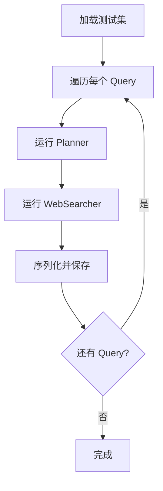
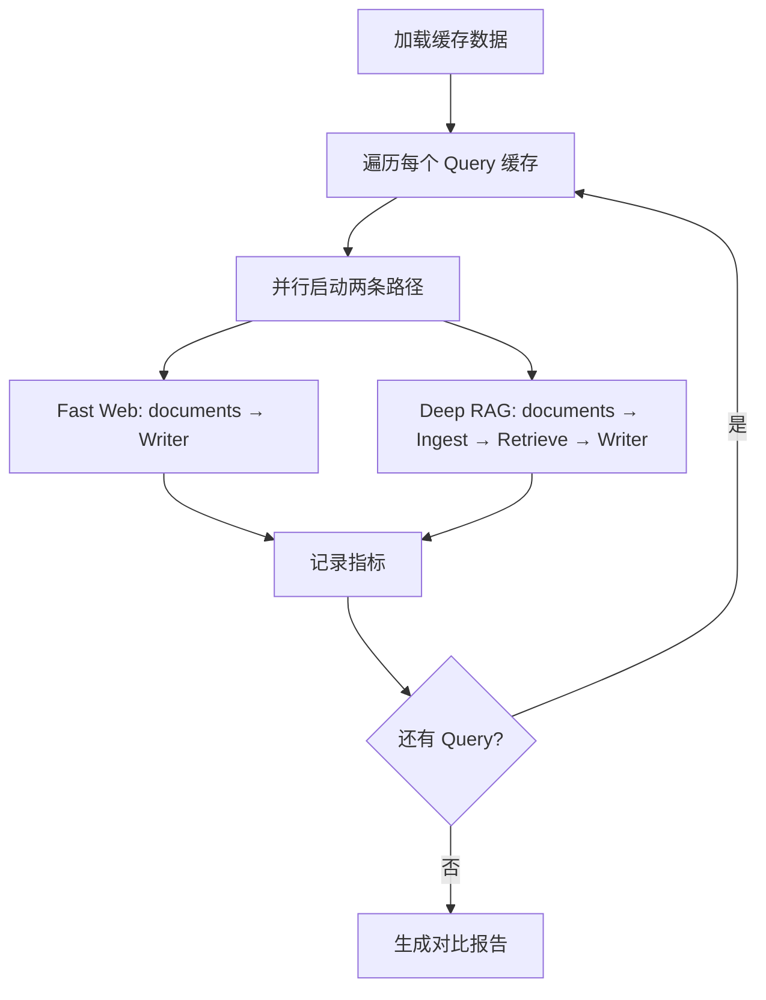

# 深度研究代理测试方案

## 一、测试目标

对比 **Fast Web** 和 **Deep RAG** 两种模式在相同输入条件下的：
1. 报告质量（相关性、准确性、完整性）
2. 执行速度（尤其是后半段的处理时间）
3. 上下文使用效率（Token 消耗 vs 信息密度）

**核心原则**：两种模式共享相同的搜索子任务（`tasks`）和相同的网页检索结果（`web_search_cache`），仅在后半段的数据处理路径上产生差异。

---

## 二、测试方法：Graph 拆分法

### 2.1 整体架构

```
┌─────────────────────────────────────────────────────────────────────────┐
│                              前半段（共享）                                │
├─────────────────────────────────────────────────────────────────────────┤
│                                                                         │
│  Query → Planner → WebSearcher → [Cache 存储: tasks + documents]      │
│                                                                         │
│         ↓                                              ↓                │
│  tasks: List[str]                          documents: List[Document]    │
│                                                                         │
└─────────────────────────────────────────────────────────────────────────┘
                              ↓ (持久化到磁盘/DB)
                              ↓
┌─────────────────────────────────────────────────────────────────────────┐
│                           后半段（并行对比）                              │
├─────────────────────────────────────────────────────────────────────────┤
│                                                                         │
│  ┌─────────────────────┐              ┌─────────────────────────────┐   │
│  │   Fast Web 路径      │              │   Deep RAG 路径               │   │
│  ├─────────────────────┤              ├─────────────────────────────┤   │
│  │                     │              │                             │   │
│  │  documents          │              │  documents                  │   │
│  │    ↓                │              │    ↓                        │   │
│  │  Writer             │              │  Ingest (VectorDB)          │   │
│  │    ↓                │              │    ↓                        │   │
│  │  Report (Baseline)  │              │  Retrieve (Top-K)            │   │
│  │                     │              │    ↓                        │   │
│  │                     │              │  Writer                    │   │
│  │                     │              │    ↓                        │   │
│  │                     │              │  Report (RAG)               │   │
│  │                     │              │                             │   │
│  └─────────────────────┘              └─────────────────────────────┘   │
│                                                                         │
└─────────────────────────────────────────────────────────────────────────┘
```

**关键变更说明**：
- 两种路径**均跳过 EvidenceFusion** 节点
- Fast Web: documents → Writer（直接使用原始文档）
- Deep RAG: documents → Ingest → Retrieve → Writer（经过向量检索压缩）

### 2.2 执行流程

#### 阶段一：数据准备（一次性运行）



**输出文件结构**：
```
eval_cache/
├── dataset_v1/
│   ├── query_001.json
│   │   ├── query: "..."
│   │   ├── tasks: ["task1", "task2", ...]
│   │   ├── documents: [Document1, Document2, ...]
│   │   └── timestamp: "2025-04-03T..."
│   ├── query_002.json
│   └── ...
└── metadata.json
    ├── total_queries: N
    ├── avg_documents_per_query: M
    └── creation_date: "..."
```

**前半段输出数据Schema定义**：
```json
{
  "$schema": "http://json-schema.org/draft-07/schema#",
  "title": "ResearchFirstHalfOutput",
  "type": "object",
  "required": ["query", "tasks", "documents", "timestamp"],
  "properties": {
    "query": {
      "type": "string",
      "description": "原始用户查询"
    },
    "tasks": {
      "type": "array",
      "description": "Planner生成的研究子任务列表",
      "items": {
        "type": "string"
      },
      "minItems": 1
    },
    "documents": {
      "type": "array",
      "description": "WebSearcher检索到的所有文档",
      "items": {
        "type": "object",
        "required": ["page_content", "metadata"],
        "properties": {
          "page_content": {
            "type": "string",
            "description": "文档的文本内容"
          },
          "metadata": {
            "type": "object",
            "required": ["url", "title"],
            "properties": {
              "url": {
                "type": "string",
                "description": "文档来源URL"
              },
              "title": {
                "type": "string",
                "description": "文档标题"
              },
              "source": {
                "type": "string",
                "description": "来源类型，如web_search"
              },
              "ingestion_session": {
                "type": "string",
                "description": "摄取会话标识（用于Deep RAG）"
              }
            }
          }
        }
      }
    },
    "timestamp": {
      "type": "string",
      "format": "date-time",
      "description": "数据生成时间戳（ISO8601格式）"
    },
    "search_provider": {
      "type": "string",
      "enum": ["tavily", "duckduckgo"],
      "description": "使用的搜索提供商"
    },
    "cache_version": {
      "type": "string",
      "default": "1.0",
      "description": "缓存数据版本号"
    }
  }
}
```

#### 阶段二：对比运行（可重复执行）



**输出文件结构**：
```
eval_results/
├── run_2025-04-03_143022/
│   ├── metrics.csv
│   │   ├── query_id, mode, duration_ms, tokens_used, ...
│   ├── reports/
│   │   ├── query_001/
│   │   │   ├── fast_web_report.md
│   │   │   ├── deep_rag_report.md
│   │   │   └── comparison.json
│   │   └── ...
│   └── summary.md
```

### 2.3 优势

1. **持久化中间结果**：可随时复用缓存的搜索结果进行多次实验
2. **清晰的控制变量**：前半段完全相同，后半段路径可独立测试
3. **批量处理友好**：适合大规模测试集的批量对比
4. **可回溯性**：每个版本的测试结果都保存完整的历史

---

## 三、测试指标

### 3.1 性能指标

| 指标名称 | 定义 | 计算方式 | 单位 |
|---------|------|---------|------|
| **planner_time** | 前半段：规划器执行时间 | `end - start` | ms |
| **search_time** | 前半段：网络搜索时间 | `end - start` | ms |
| **ingest_time** | 后半段：Deep RAG 入库时间 | `end - start` | ms |
| **retrieve_time** | 后半段：Deep RAG 检索时间 | `end - start` | ms |
| **writer_time_fast** | 后半段：Fast Web 报告生成时间 | `end - start` | ms |
| **writer_time_rag** | 后半段：Deep RAG 报告生成时间 | `end - start` | ms |
| **total_backend_time_fast** | 后半段：Fast Web 总处理时间 | `writer_time_fast` | ms |
| **total_backend_time_rag** | 后半段：Deep RAG 总处理时间 | `ingest_time + retrieve_time + writer_time_rag` | ms |
| **compression_ratio** | 上下文压缩比 | `original_doc_count / retrieved_doc_count` | 倍 |
| **compression_ratio_tokens** | Token压缩比 | `original_doc_tokens / retrieved_doc_tokens` | 倍 |
| **api_calls_count** | LLM API 调用次数 | 计数器 | 次 |
| **tokens_input_fast** | Fast Web 输入 Token 消耗 | 累加 | tokens |
| **tokens_input_rag** | Deep RAG 输入 Token 消耗 | 累加 | tokens |
| **tokens_output** | 输出 Token 总消耗 | 累加 | tokens |

### 3.2 质量指标（需人工评估或 LLM 辅助评估）

| 指标名称 | 定义 | 评估方式 | 评分范围 |
|---------|------|---------|---------|
| **relevance** | 报告与查询的相关性 | LLM-as-judge 或 人工评分 | 1-5 |
| **completeness** | 关键信息的覆盖程度 | 与预期答案对比 | 1-5 |
| **accuracy** | 事实准确性 | 事实核查 | 1-5 |
| **coherence** | 报告逻辑连贯性 | LLM-as-judge | 1-5 |
| **citation_quality** | 引用的准确性和可追溯性 | 检查引用与内容的对应关系 | 1-5 |
| **conciseness** | 信息密度 | 报告长度 / 信息量 | 1-5 |

### 3.3 效率指标

| 指标名称 | 定义 | 计算方式 | 单位 |
|---------|------|---------|------|
| **context_compression_ratio** | 上下文压缩比 | `original_doc_tokens / retrieved_doc_tokens` | % |
| **time_overhead** | Deep RAG 相对 Fast Web 的额外时间 | `(rag_time - fast_time) / fast_time` | % |
| **token_savings** | Token 消耗节省比例 | `(fast_tokens - rag_tokens) / fast_tokens` | % |

---

## 四、测试集设计

### 4.1 测试集分类

#### A. 基础功能测试集（小型，快速验证）
**规模**：5-10 个查询
**目的**：验证两种路径都能正常生成报告

| Query 类型 | 示例数量 | 特征 |
|-----------|---------|------|
| 简单事实查询 | 3 | 有明确答案，信息集中 |
| 定义解释类 | 2 | 概念性知识 |
| 列表汇总类 | 2 | 多项并列信息 |

**示例问题**：
- "什么是 Transformer 架构？"
- "2024 年诺贝尔物理学奖得主是谁？"
- "列出 Python 中常用的数据结构。"

#### B. 质量对比测试集（中型，核心实验）
**规模**：30-50 个查询
**目的**：系统对比两种模式的报告质量差异

| Query 类型 | 示例数量 | 特征 |
|-----------|---------|------|
| 复杂综合性查询 | 10 | 多方面信息，需要整合 |
| 技术深度解析 | 10 | 需要技术细节 |
| 多源验证类 | 10 | 需要对比不同来源信息 |
| 时效性查询 | 10 | 最新信息，验证搜索有效性 |

**示例问题**：
- "对比 GPT-4 和 Claude 3 的性能差异。"
- "分析 2024 年人工智能大模型的技术发展趋势。"
- "评估量子计算在密码学中的应用前景和挑战。"

#### C. 压力测试集（大型，极限场景）
**规模**：100+ 个查询
**目的**：测试系统在大规模场景下的稳定性和性能

| Query 类型 | 示例数量 | 特征 |
|-----------|---------|------|
| 高冗余信息查询 | 30 | 搜索结果包含大量重复/相似内容 |
| 长尾知识查询 | 30 | 信息分散在多个来源 |
| 多轮衍生查询 | 40 | 基于前一个查询的追问 |

**示例问题**：
- "详细分析全球主要国家的碳中和政策进展。"
- "综述人工智能在医疗领域的应用案例和临床效果。"
- "比较不同编程语言在后端开发中的适用场景。"

#### D. 领域专项测试集（可选，领域定制）
**规模**：20-30 个查询
**目的**：验证在特定领域的表现

| 领域 | 示例数量 | 特征 |
|------|---------|------|
| 医疗健康 | 10 | 专业术语，需要准确性 |
| 金融财经 | 10 | 数据密集，需要时效性 |
| 法律法规 | 10 | 条款解读，需要严谨性 |

### 4.2 测试集数据格式

```json
{
  "dataset_name": "quality_comparison_v1",
  "version": "1.0",
  "queries": [
    {
      "id": "q001",
      "query": "什么是 Transformer 架构？",
      "category": "definition",
      "expected_topics": ["attention mechanism", "self-attention", "encoder-decoder"],
      "difficulty": "easy",
      "tags": ["nlp", "deep learning"]
    }
  ]
}
```

---

## 五、评估方法

### 5.1 自动化评估（LLM-as-Judge）

使用一个更强的 LLM（如 GPT-4）作为评估者，对两个模式的报告进行对比打分。

**评估维度**：
1. **Relevance**：报告是否回答了原始查询
2. **Completeness**：是否覆盖了所有重要的子话题
3. **Coherence**：逻辑是否清晰连贯
4. **Factuality**：事实陈述是否准确
5. **Citation**：引用是否准确对应

**输出示例**：
```json
{
  "query_id": "q001",
  "fast_web_scores": {
    "relevance": 3.5,
    "completeness": 3.8,
    "coherence": 4.2,
    "factuality": 4.0,
    "citation": 4.3,
    "average": 4.16
  },
  "deep_rag_scores": {
    "relevance": 4.7,
    "completeness": 4.5,
    "coherence": 4.6,
    "factuality": 4.4,
    "citation": 4.8,
    "average": 4.60
  },
  "comparison": {
    "winner": "deep_rag",
    "improvement": "+0.44",
    "key_differences": [
      "Deep RAG 提供了更全面的技术细节",
      "Deep RAG 的引用更加准确"
    ]
  }
}
```

### 5.2 人工评估（抽样验证）

从测试集中抽取 10-20 个代表性样本（如，每种类型选1-2个样本/选两种模式差异最大的案例/选质量评分最低的失败案例），由人工进行详细评估。

**评估表格**：
| Query ID | Mode | Relevance (1-5) | Completeness (1-5) | Coherence (1-5) | Factuality (1-5) | Citation (1-5) | Comments |
|----------|------|-----------------|-------------------|-----------------|------------------|----------------|----------|
| q001 | Fast Web | 4 | 3 | 4 | 4 | 4 | 缺少某些细节 |
| q001 | Deep RAG | 5 | 5 | 5 | 5 | 5 | 更全面 |

### 5.3 统计分析

对测试结果进行统计显著性检验（如 t 检验），确定两种模式在质量指标上的差异是否显著。

**统计指标**：
- 平均分对比
- 标准差对比
- 置信区间
- p 值

---

## 六、执行计划

### 6.1 开发阶段（Week 1-2）

- [ ] 实现 Graph 拆分逻辑（前半段独立模块）（保留原有的文件逻辑，新增文件实现新的拆分逻辑）
- [ ] 实现缓存序列化/反序列化
- [ ] 实现后半段并行执行
- [ ] 实现指标收集和记录

### 6.2 数据准备阶段（Week 2-3）

- [ ] 构建基础功能测试集（10 个查询）
- [ ] 运行前半段生成缓存数据
- [ ] 验证缓存数据完整性

### 6.3 初步测试阶段（Week 3）

- [ ] 运行对比测试（基础集）
- [ ] 收集性能指标
- [ ] 初步分析结果

### 6.4 扩展测试阶段（Week 4-5）

- [ ] 构建质量对比测试集（50 个查询）
- [ ] 运行大规模对比测试
- [ ] 实现 LLM-as-Judge 评估
- [ ] 人工抽样评估（10-20 个样本）

### 6.5 分析与优化阶段（Week 5-6）

- [ ] 统计分析测试结果
- [ ] 生成可视化报告
- [ ] 根据结果优化 Deep RAG 参数
- [ ] 编写测试报告和文档

---

## 七、预期输出

### 7.1 测试报告结构

```
eval_report/
├── 2025-04-03_comparison_report.md
│   ├── 执行摘要
│   ├── 方法论
│   ├── 性能对比
│   ├── 质量对比
│   ├── 统计显著性分析
│   ├── 关键发现
│   └── 结论与建议
├── charts/
│   ├── performance_comparison.png
│   ├── quality_scores.png
│   ├── token_usage.png
│   └── time_distribution.png
└── raw_data/
    ├── metrics.csv
    ├── detailed_metrics.json
    └── evaluation_results.json
```

### 7.2 关键发现模板

- **Fast Web 优势场景**：简单查询、时效性要求高、信息集中
- **Deep RAG 优势场景**：复杂综合查询、多源整合、需要压缩上下文
- **推荐配置**：针对不同场景的建议模式选择
- **参数调优建议**：Top-K 值、相似度阈值等

---

## 八、风险与限制

### 8.1 已知限制

1. **搜索结果的时效性**：缓存的数据可能过时，需要定期更新
2. **LLM-as-Judge 的偏差**：评估者 LLM 可能有偏好
3. **人工评估的主观性**：不同评估者可能有不同标准

### 8.2 缓解措施

1. 设置缓存过期时间（如 7 天），过期后重新搜索
2. 使用多个 LLM 评估者进行交叉验证
3. 制定明确的人工评估指南，进行评估者校准

---

## 九、后续扩展

1. **多模式扩展**：增加 Local Only 模式到对比中
2. **参数网格搜索**：系统测试不同 Top-K、相似度阈值的效果
3. **长期跟踪**：建立持续测试管道，定期验证系统表现
4. **A/B 测试框架**：集成到生产环境，进行真实用户反馈收集

---

## 十、总结

本测试方案通过 **Graph 拆分法** 实现了对 Fast Web 和 Deep RAG 两种模式的系统性对比：

- ✅ **控制变量**：确保前半段完全相同
- ✅ **可重复性**：中间结果持久化，支持多次实验
- ✅ **可扩展性**：支持多规模测试集，从小型验证到大规模压力测试
- ✅ **多维度评估**：性能、质量、效率全方位对比
- ✅ **自动化友好**：支持 CI/CD 集成，持续验证

该方案将为 Deep RAG 的效果提供充分的实证支持，并指导在不同场景下的模式选择策略。
